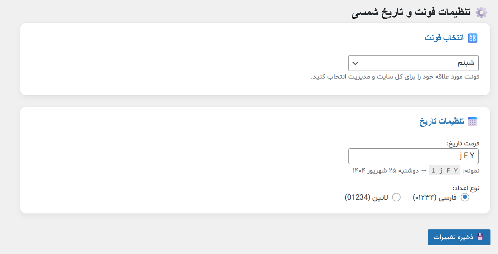
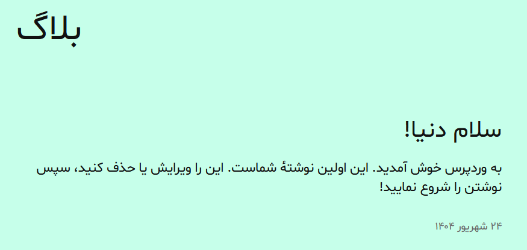

# WP Jalali Vazir Pro Final 3

**افزونه حرفه‌ای وردپرس برای تبدیل تاریخ‌ها به شمسی، تغییر فونت سایت و پنل مدیریت، با تنظیمات گرافیکی پیشرفته.**

---

## 🌟 ویژگی‌ها

- تبدیل تمامی تاریخ‌های وردپرس به **تاریخ شمسی (Jalali)**  
- انتخاب **فرمت دلخواه تاریخ**  
- پشتیبانی از **اعداد فارسی و لاتین**  
- تغییر **فونت کل سایت و پنل مدیریت** با فونت‌های محبوب فارسی:  
  

  - Vazir  
  - Yekan  
  - Shabnam  
  - Dana  
  - IranSans  

- **صفحه تنظیمات حرفه‌ای و گرافیکی** برای انتخاب فونت، فرمت تاریخ و نوع اعداد  
- رفع خطای `gmdate()` در داشبورد وردپرس  
- نمایش صحیح آیکون‌های Dashicons و ab-icon  

---

## 🛠 نصب و راه‌اندازی

1. فایل افزونه ZIP را از این مخزن دانلود یا از مسیر `wp-content/plugins/` آپلود کنید.  
2. افزونه را فعال کنید.  
3. فونت‌های موردنظر خود را داخل پوشه `fonts/` افزونه قرار دهید:
fonts/vazir.woff2
fonts/yekan.woff2
fonts/shabnam.woff2
fonts/dana.woff2
fonts/iransens.woff2

4. وارد بخش **تنظیمات → فونت و تاریخ شمسی** شوید و تنظیمات دلخواه خود را اعمال کنید:  
- انتخاب فونت  
- انتخاب فرمت تاریخ  
- انتخاب نوع اعداد (فارسی یا لاتین)  

---

## 🖼 تصاویر محیط افزونه

**صفحه تنظیمات گرافیکی:**

**نمایش سایت با فونت دلخواه و تاریخ شمسی:**

---

## ⚙️ نکات مهم

- اعداد فارسی تنها در **نمایش سایت (Frontend)** اعمال می‌شوند.  
- در داشبورد وردپرس، اعداد به صورت لاتین باقی می‌مانند تا از خطای `gmdate()` جلوگیری شود.  
- افزونه با تمامی قالب‌های وردپرس سازگار است.  
- برای افزودن فونت جدید، فایل فونت را در پوشه `fonts/` قرار دهید و نام آن را در افزونه ثبت کنید.  

---

## 💡 توسعه و سفارشی‌سازی

- تغییر فرمت تاریخ و نوع اعداد از طریق صفحه تنظیمات افزونه امکان‌پذیر است.  
- افزودن فونت‌های جدید با قرار دادن فایل در پوشه `fonts/` و ثبت در آرایه `$fonts`.  

---

## 📌 پشتیبانی

- [Issues](https://github.com/YourUsername/wp-jalali-vazir-pro/issues) این مخزن را بررسی کنید.  
- یا در انجمن پشتیبانی وردپرس سؤال خود را مطرح کنید.  

---

## 📜 مجوز

این افزونه تحت **GPLv2 یا بالاتر** منتشر شده است.

---

## 🔗 Badges

