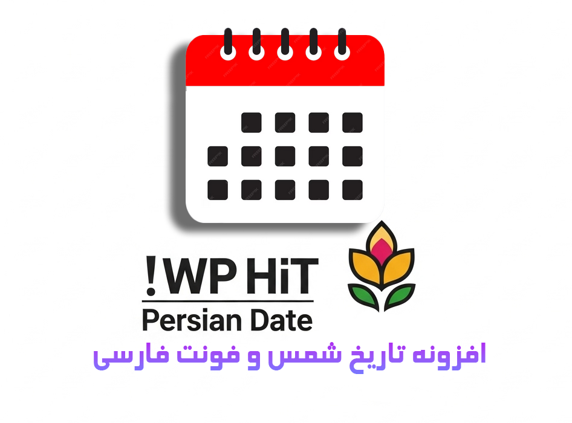
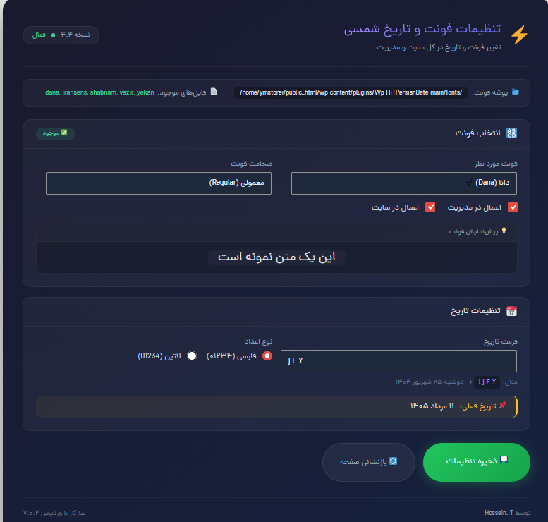

# ⚡ WP-HiTPersianDate

<div align="center">


</div>

<p align="center">
  <strong>✨ تبدیل خودکار تاریخ‌ها به شمسی + تغییر فونت مدیریت وردپرس</strong>
</p>

<p align="center">
  <a href="#-ویژگی‌ها">ویژگی‌ها</a> •
  <a href="#-نصب">نصب</a> •
  <a href="#-تنظیمات">تنظیمات</a> •
  <a href="#-ساختار-فایل‌ها">ساختار</a> •
  <a href="#-پشتیبانی">پشتیبانی</a>
</p>

---

## 📸 پیش‌نمایش

<div align="center">
  
  <br/>
  <em>✨ صفحه تنظیمات با تم دارک و طراحی مدرن</em>
</div>

<br/>

<div align="center">
  
  <br/>
  <em>🎨 انتخاب فونت با پیش‌نمایش زنده</em>
</div>

---

## 🌟 ویژگی‌ها

### 🔠 **فونت حرفه‌ای**
- ✅ تغییر فونت مدیریت وردپرس به **وزیر** (Vazir) به‌صورت پیش‌فرض
- ✅ پشتیبانی از فونت‌های محبوب فارسی: وزیر (Vazir) - یکان (Yekan) - شبنم (Shabnam) - دانا (Dana) - ایران‌سنس (IranSans)
- ✅ انتخاب ضخامت فونت (معمولی / ضخیم)
- ✅ بارگذاری خودکار از پوشه `fonts/` یا CDN
- ✅ پیش‌نمایش زنده فونت هنگام تغییر

### 📅 **تاریخ شمسی**
- ✅ تبدیل تمام تاریخ‌های وردپرس به **تاریخ شمسی (Jalali)**
- ✅ پشتیبانی از فرمت‌های مختلف تاریخ (قابل تنظیم)
- ✅ نمایش اعداد فارسی یا لاتین (قابل انتخاب)
- ✅ تبدیل تاریخ در: مدیریت وردپرس - صفحه اصلی سایت - پست‌ها و صفحات - کامنت‌ها - تاریخ ثبت‌نام کاربران - تنظیمات عمومی وردپرس

### 🎨 **طراحی مدرن**
- ✅ تم **دارک** با گرادیان بنفش-آبی
- ✅ کارت‌های شیشه‌ای با افکت `backdrop-filter`
- ✅ دکمه ذخیره سبز با گوشه‌های گرد
- ✅ نمایش وضعیت فایل‌های فونت
- ✅ کاملاً واکنش‌گرا (Responsive)
- ✅ بدون انیمیشن‌های مزاحم

---

## 📥 نصب

### روش اول: نصب از طریق فایل ZIP

1. فایل `wp-hitpersiandate.zip` را از این مخزن دانلود کنید.
2. در وردپرس به **افزونه‌ها → افزودن جدید → بارگذاری افزونه** بروید.
3. فایل ZIP را انتخاب کرده و **نصب** کنید.
4. افزونه را **فعال** کنید.

### روش دوم: نصب دستی

```bash
cd /path/to/wordpress/wp-content/plugins/
git clone https://github.com/hosseinit1988/Wp-HiTPersianDate.git
```

سپس افزونه را از بخش **افزونه‌ها** فعال کنید.

---

## 📂 ساختار فایل‌ها

```
wp-hitpersiandate/
├── fonts/                          # پوشه فونت‌ها
│   ├── vazir.woff2                # فونت وزیر
│   ├── yekan.woff2                # فونت یکان
│   ├── shabnam.woff2              # فونت شبنم
│   ├── dana.woff2                 # فونت دانا
│   └── iransens.woff2             # فونت ایران‌سنس
├── wp-HitPersianDate.php          # فایل اصلی افزونه
├── LICENSE.txt                     # مجوز
└── README.md                       # این فایل
```

---

## ⚙️ تنظیمات

### مسیر دسترسی به تنظیمات

**پیشخوان وردپرس → تنظیمات → فونت و تاریخ شمسی**

### تنظیمات موجود

#### 🔠 **انتخاب فونت**
- انتخاب فونت از بین ۵ فونت محبوب فارسی
- انتخاب ضخامت فونت (معمولی / ضخیم)
- اعمال فونت در مدیریت و/یا سایت

#### 📅 **تنظیمات تاریخ**
- فرمت تاریخ سفارشی (مثال: `l j F Y`)
- انتخاب اعداد فارسی یا لاتین

---

## 🎯 مثال‌های فرمت تاریخ

| فرمت | خروجی |
|------|--------|
| `l j F Y` | دوشنبه ۲۵ شهریور ۱۴۰۴ |
| `Y/m/d` | ۱۴۰۴/۰۶/۲۵ |
| `j F Y` | ۲۵ شهریور ۱۴۰۴ |
| `Y-m-d` | ۱۴۰۴-۰۶-۲۵ |

---

## 🔧 توسعه و سفارشی‌سازی

### افزودن فونت جدید

1. فایل `woff2` فونت را در پوشه `fonts/` قرار دهید.
2. در آرایه `$fonts` کلاس اصلی، فونت جدید را اضافه کنید:

```php
private $fonts = [
    'vazir' => 'وزیر (Vazir)',
    'yekan' => 'یکان (Yekan)',
    // ...
    'newfont' => 'نام فونت جدید',
];
```

### تغییر فرمت تاریخ پیش‌فرض

در صفحه تنظیمات، فرمت مورد نظر خود را وارد کنید.

---

## 🧪 سازگاری

| وردپرس | PHP | مرورگر |
|---------|-----|--------|
| ۷.۰.۲+ | ۷.۴+ | Chrome ✅ |
| ۶.۰+ | ۸.۰+ | Firefox ✅ |
| ۵.۹+ | ۸.۱+ | Safari ✅ |
| ۵.۰+ | ۸.۲+ | Edge ✅ |

---

## ❓ پرسش‌های متداول

### چرا فونت‌ها نمایش داده نمی‌شوند؟
۱. مطمئن شوید فایل‌های `woff2` در پوشه `fonts/` قرار دارند.
۲. افزونه را غیرفعال و دوباره فعال کنید.
۳. کش مرورگر خود را پاک کنید.

### چگونه تاریخ را در قالب سایت تغییر دهم؟
افزونه به‌صورت خودکار تاریخ‌ها را در کل سایت تبدیل می‌کند. اگر قالب شما از توابع استاندارد وردپرس استفاده می‌کند، نیازی به تنظیم اضافی نیست.

### آیا با افزونه‌های دیگر تداخل دارد؟
خیر، افزونه به‌صورت مستقل کار می‌کند و با اکثر افزونه‌ها سازگار است.

---

## 📜 مجوز

این پروژه تحت مجوز **GPLv2 یا بالاتر** منتشر شده است.

```
This program is free software; you can redistribute it and/or modify
it under the terms of the GNU General Public License as published by
the Free Software Foundation; either version 2 of the License, or
(at your option) any later version.
```

---

## 🤝 مشارکت

اگر ایده‌ای برای بهبود این افزونه دارید:

1. مخزن را **Fork** کنید.
2. تغییرات خود را اعمال کنید.
3. یک **Pull Request** ارسال کنید.

---

## 📞 پشتیبانی

- **گیت‌هاب**: [https://github.com/hosseinit1988/Wp-HiTPersianDate](https://github.com/hosseinit1988/Wp-HiTPersianDate)
- **انجمن وردپرس**: [https://wordpress.org/support/](https://wordpress.org/support/)

---

<div align="center">

**❤️ ساخته شده با عشق برای جامعه وردپرس فارسی**

[](https://github.com/hosseinit1988/Wp-HiTPersianDate/stargazers)
[](https://github.com/hosseinit1988/Wp-HiTPersianDate/network/members)

</div>
